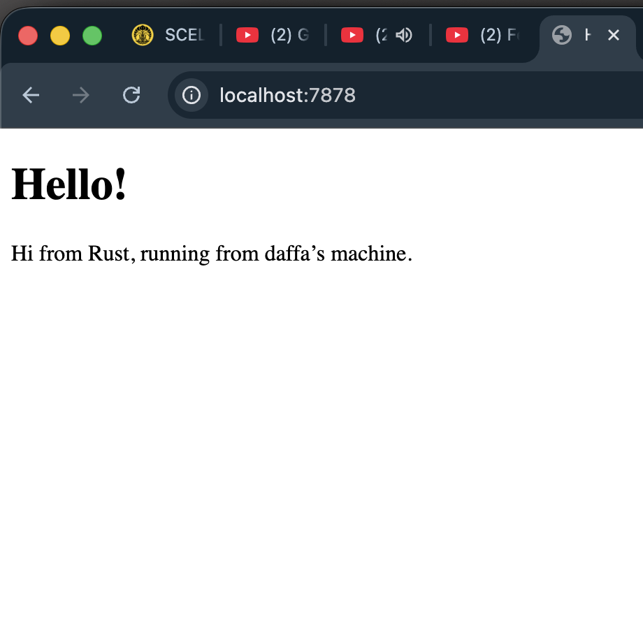

## Commit 1 Reflection notes

content of handle_connection:
- Take a tcp connection aka stream as an argument
- Make buffered reader wrapping the address of the stream
- Read each line of the stream until it reaches an empty line
- Gathers all lines into a Vector of strings
- The vector, which now contains an http requests, is printed

## Commit 2 Reflection notes

new content of handle_connection:
- Same reading http request logic as commit 1 but no printing
- Make a http status line
- Read the contents of hello.html file
- Get the length of the file contents
- Build and format an http response with a status line, html page, and content length
- Write the http response to the stream so the client receives it